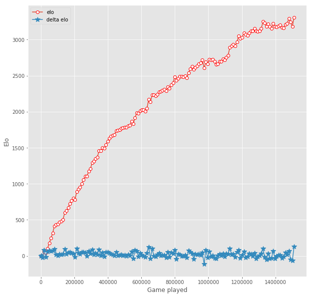

# 下棋: 中国象棋Alpha Zero
我的程式是修改自 github(bupticybee) 的 icyChessZero專案，網址為https://github.com/bupticybee/icyChessZero

# 課程:人工智慧 -- 筆記、習題與報告

欄位 | 內容
-----|--------
學期 | 110 學年度下學期
學生 |  鄧筌祐
學號末兩碼 | 49
教師 | [陳鍾誠](https://www.nqu.edu.tw/educsie/index.php?act=blog&code=list&ids=4)
學校科系 | [金門大學資訊工程系](https://www.nqu.edu.tw/educsie/index.php)
課程內容 | https://gitlab.com/ccc110/ai
教材網址 | [陳鍾誠的人工智慧課程](https://kinmen6.com/root/%E9%99%B3%E9%8D%BE%E8%AA%A0/%E8%AA%B2%E7%A8%8B/%E4%BA%BA%E5%B7%A5%E6%99%BA%E6%85%A7/README.md)


目前的elo：



詳細勝率表：


目前棋力還比較一般，因為是從完全隨機開始訓練的，比方說某個對局片段(800 playouts)：


# 推薦代碼運行環境
* python==3.6.0
* tensorflow==1.4.0
* threadpool==1.3.2
* xmltodict==0.11.0
* urllib3==1.22
* numpy==1.14.3
* tflearn==0.3.2
* pandas==0.19.2
* scipy==1.1.0
* matplotlib==2.0.0
* tqdm==4.19.4
* tornado==4.5.1(集群master必须安装，slave不需要)
* uvloop==0.9.1(windows可不装)

# 推薦機器環境
* windows 或 linux服務器
* 16G以上內存
* 4個以上CPU物理核
* 一張以上能夠進行深度學習運算的顯卡

集群分為master和slave，加入集群的機器均為slave，master和slave分工如下：
* slave : 負責自動從master拉取最新模型權重，完成自對弈，並且把棋譜自動上傳到master
* master: 負責給slave提供權重，並且負責模型的更新，評估，以及從slave接收棋譜

clone工程後在cmd中執行下面命令

```
cd script

./multithread_start.bat [thread_number] [gpu_core] [python_env]
```

比如:

```
./multithread_start.bat 10 0 python3
```

意味著在0號GPU上用python3環境跑10個進程（一般一個1080ti GPU可以支持到至多24個進程），然而GPU並不是唯一瓶頸，不推薦跑超過物理核數兩倍的進程數量。

## linux 機器加入集群

clone工程後在shell中執行

```
cd script

```
比如:

```
sh multithread_start.sh -t 10 -g 0 -p python3 
```
意味著在0號GPU上用python3環境跑10個進程（與上面windows版本對應)


# 查看棋譜
slave機器運行出來的棋譜在 ```data/distributed``` 目錄下，是cbf文件，可以通過"象棋橋"軟件查看，也可以在 ``` ipynbs/see_gameplay.ipynb ``` 中查看

# 查看訓練狀態
master 機器可以在```ipynbs/elo_graph.ipynb``` 中查看集群訓練的模型的elo到什麼水平了。


# 沒做的事
還有挺多東西可以做的，工程也還在快速開發,比如：
1. 給棋譜加上一些meta，比如每一步的mcts分析，方便查個別case

~~2.長將和長捉的判斷還沒有做~~

3. 給代碼加上版本限制，master只接受與自己版本相同的slave的棋譜
4. 專門搞一個web ui實時展示elo和棋譜等
5. readme寫清楚模塊劃分

